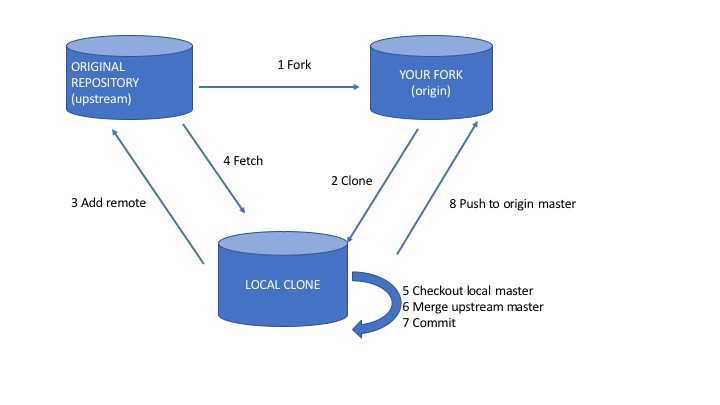

# Sync your forked repo




## Configure a remote that points to the upstream repository 

Change <GIT_LOCAL_WORKING_COPY> placeholder with a path pointing to your local working copy of the forked repo

```
$ cd <GIT_LOCAL_WORKING_COPY>
$ git remote add upstream https://github.com/ORIGINAL_OWNER/ORIGINAL_REPOSITORY.git
```

Verify the new upstream repository you've specified for your fork.

```
$ git remote -v
> origin    https://github.com/YOUR_USERNAME/YOUR_FORK.git (fetch)
> origin    https://github.com/YOUR_USERNAME/YOUR_FORK.git (push)
> upstream  https://github.com/ORIGINAL_OWNER/ORIGINAL_REPOSITORY.git (fetch)
> upstream  https://github.com/ORIGINAL_OWNER/ORIGINAL_REPOSITORY.git (push)
```


## Fetch the branches and their respective commits from the upstream repository. 

Commits to master will be stored in a local branch, upstream/master.

```
$ git fetch upstream
> remote: Counting objects: 75, done.
> remote: Compressing objects: 100% (53/53), done.
> remote: Total 62 (delta 27), reused 44 (delta 9)
> Unpacking objects: 100% (62/62), done.
> From https://github.com/ORIGINAL_OWNER/ORIGINAL_REPOSITORY
>  * [new branch]      master     -> upstream/master
```

Check out your fork's local master branch.

```
$ git checkout master
> Switched to branch 'master'
```

Merge the changes from upstream/master into your local master branch. This brings your fork's master branch into sync with the upstream repository, without losing your local changes.

```
$ git merge upstream/master
> Updating a422352..5fdff0f
> Fast-forward
>  README                    |    9 -------
>  README.md                 |    7 ++++++
>  2 files changed, 7 insertions(+), 9 deletions(-)
>  delete mode 100644 README
>  create mode 100644 README.md
```

If your local branch didn't have any unique commits, Git will instead perform a "fast-forward":

```
$ git merge upstream/master
> Updating 34e91da..16c56ad
> Fast-forward
>  README.md                 |    5 +++--
>  1 file changed, 3 insertions(+), 2 deletions(-)
```


