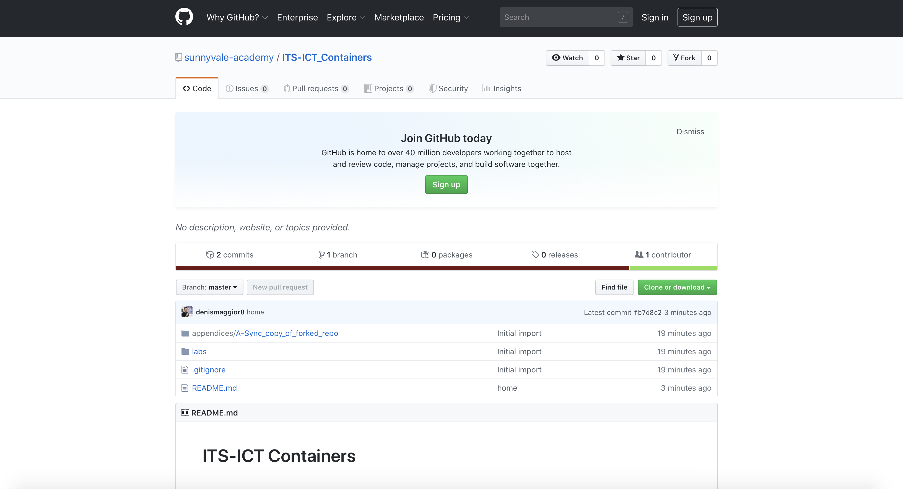
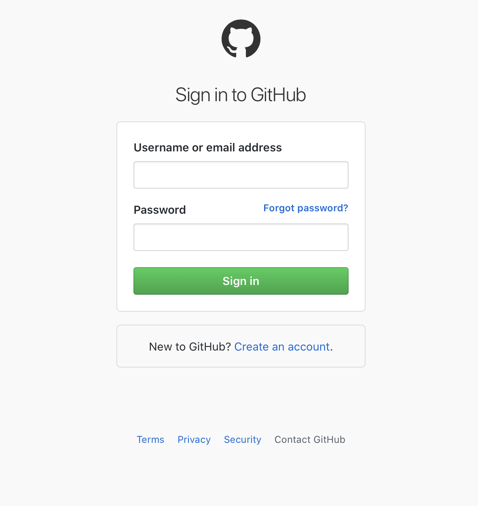

# Fork and clone this repo

## Prerequisites

- A github account

## Fork the repo

Open your browser and go to: https://github.com/sunnyvale-academy/ITS-ICT_Containers

The ITS-ICT_Containers repo home page opens:



Click on **Fork** button at the top-right of the screen. GitHub asks you to authenticate:



When you enter as logged-in user, re-click on **Fork** button at the top-right of the screen. Forking a repository allows you create a copy of the original repo on your GitHub account so as to freely experiment with changes without affecting the original project.

## Clone the forked repo

When forked the original repo, clone it on your PC.

In the following command, please make sure to change \<YOUR GITHUB ACCOUNT\> placeolders accordingly:

- \<YOUR PREFERRED FOLDER\> with the folder you want to clone this repo into
- \<YOUR GITHUB ACCOUNT\>  with your actual GitHub account (i.e. mine is denismaggior8)

```
$ cd <YOUR PREFERRED FOLDER>
$ git clone https://github.com/<YOUR GITHUB ACCOUNT>/ITS-ICT_Containers
```

Please not that your forked repo, nor your local clone, will receive new commits from the original repo automatically; you need to pull updates manually, please refer to appendix [A - Sync copy of forked repo](../../appendices/A-Sync_copy_of_forked_repo/README.md)

If you need some Git help, download [**The Git cheat-sheet**](https://www.atlassian.com/dam/jcr:8132028b-024f-4b6b-953e-e68fcce0c5fa/atlassian-git-cheatsheet.pdf)