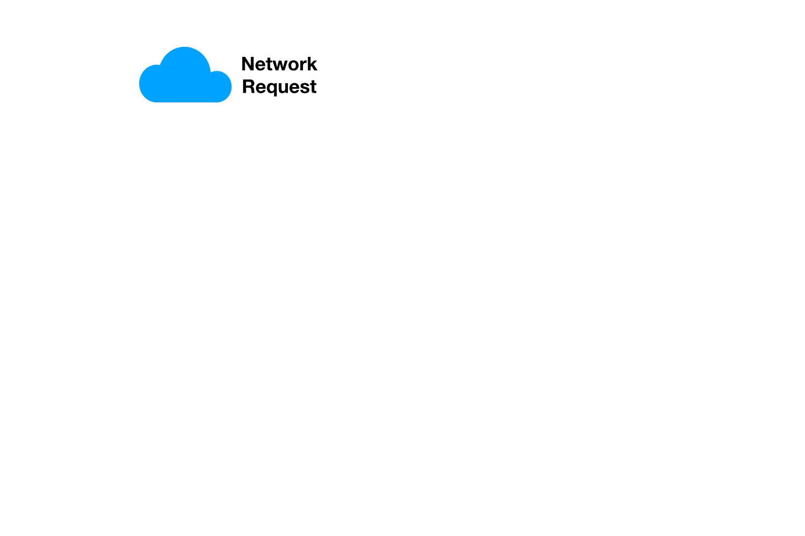

# Service

Kubernetes Pods are mortal. They are born and when they die, they are not resurrected. If you use a Deployment to run your app, it can create and destroy Pods dynamically.
Each Pod gets its own IP address, however in a Deployment, the set of Pods running in one moment in time could be different from the set of Pods running that application a moment later.
This leads to a problem: if some set of Pods (call them “backends”) provides functionality to other Pods (call them “frontends”) inside your cluster, how do the frontends find out and keep track of which IP address to connect to, so that the frontend can use the backend part of the workload?

Services solve this problem mapping requests to Pod using selectors.



There are three types of services:

- **ClusterIP** – The default value. The service is only accessible from within the Kubernetes cluster – you can’t make requests to your Pods from outside the cluster!
- **NodePort** – This makes the service accessible on a static port on each Node in the cluster. This means that the service can handle requests that originate from outside the cluster.
- **LoadBalancer** – The service becomes accessible externally through a cloud provider's load balancer functionality. GCP, AWS, Azure, and OpenStack offer this functionality. The cloud provider will create a load balancer, which then automatically routes requests to your Kubernetes Service


## ClusterIP


To try this demo, let's create a Deployment to spawn 2 nginx Pod (replicas=2).

```console
$ kubectl apply -f  nginx_latest-deployment.yaml 
deployment.apps/nginx-deployment created
```

To check if the Pods are running, after a few minutes type:

```console
$ kubectl get deployments -o wide 
NAME               READY   UP-TO-DATE   AVAILABLE   AGE   CONTAINERS   IMAGES         SELECTOR
nginx-deployment   2/2     2            2           38s   nginx        nginx:latest   app=nginx
```

If you see 2/2 it means everything worked as expected.

Creating a Service means allowing the access to that Pods

```console
$ kubectl apply -f service_clusterip.yaml
service/clusterip-service created
```

Let's inspect our first service (the service you create on your cluster may differ slightly)

```console
$ kubectl get services -o wide 
NAME                TYPE        CLUSTER-IP      EXTERNAL-IP   PORT(S)    AGE     SELECTOR
clusterip-service   ClusterIP   10.96.225.222   <none>        8080/TCP   30s     app=nginx
```

This means that your Pods are accessible ONLY within the cluster with IP address **10.96.225.222** or by its **name**.

To verify it, we spawn a busybox Pod in order to contact the service's name from within the Kubernetes cluster.

```console
$ kubectl run -i --rm --tty busybox --image=busybox --restart=Never -- wget -qO- clusterip-service:8080 
<!DOCTYPE html>
<html>
<head>
<title>Welcome to nginx!</title>
<style>
    body {
        width: 35em;
        margin: 0 auto;
        font-family: Tahoma, Verdana, Arial, sans-serif;
    }
</style>
</head>
<body>
<h1>Welcome to nginx!</h1>
<p>If you see this page, the nginx web server is successfully installed and
working. Further configuration is required.</p>

<p>For online documentation and support please refer to
<a href="http://nginx.org/">nginx.org</a>.<br/>
Commercial support is available at
<a href="http://nginx.com/">nginx.com</a>.</p>

<p><em>Thank you for using nginx.</em></p>
</body>
</html>
pod "busybox" deleted
```

The **ClusterIP** service type is useful for backend Pods that need to be called only from within the Kubernetes cluster by other (may be frontend) Pods.

What if you want to expose your Pods to the outside world? NodePort service type is made for that.

## NodePort

```console
$ kubectl apply -f service_nodeport.yaml
service/clusterip-service configured
```

Your service has been created 

```console
$ kubectl get services 
clusterip-service   ClusterIP   10.110.67.72    <none>        8080/TCP         16s     app=nginx
nodeport-service    NodePort    10.107.54.251   <none>        8080:31879/TCP   8s      app=nginx
```

```console
$ kubectl describe service nodeport-service 
Name:                     nodeport-service
Namespace:                default
Labels:                   <none>
Annotations:              kubectl.kubernetes.io/last-applied-configuration:
                            {"apiVersion":"v1","kind":"Service","metadata":{"annotations":{},"name":"nodeport-service","namespace":"default"},"spec":{"ports":[{"name"...
Selector:                 app=nginx
Type:                     NodePort
IP:                       10.107.54.251
Port:                     http  8080/TCP
TargetPort:               80/TCP
NodePort:                 http  31879/TCP
Endpoints:                10.244.1.26:80,10.244.2.25:80
Session Affinity:         None
External Traffic Policy:  Cluster
Events:                   <none>
```

The following command is meant to try access the service by pointing to a worker's ip address and port 30100. You can just copy & paste IP:PORT in your browser to achieve the same.

**In the command below, use localhost ONLY if you are using the Docker Desktop Kubernetes cluster, if not just use the IP address of one Kubernetes node**

```console
$ curl localhost:31879
<!DOCTYPE html>
<html>
<head>
<title>Welcome to nginx!</title>
<style>
    body {
        width: 35em;
        margin: 0 auto;
        font-family: Tahoma, Verdana, Arial, sans-serif;
    }
</style>
</head>
<body>
<h1>Welcome to nginx!</h1>
<p>If you see this page, the nginx web server is successfully installed and
working. Further configuration is required.</p>

<p>For online documentation and support please refer to
<a href="http://nginx.org/">nginx.org</a>.<br/>
Commercial support is available at
<a href="http://nginx.com/">nginx.com</a>.</p>

<p><em>Thank you for using nginx.</em></p>
</body>
</html>
```

Of course if you point to the other worker the result is the same (since Pod replica is 2 and we expect to find 1 Pod per node)


## LoadBalancer

When the Service type is set to **LoadBalancer**, Kubernetes provides functionality equivalent to type equals ClusterIP to pods within the cluster and extends it by programming the (external to Kubernetes) load balancer with entries for the Kubernetes pods.

LoadBalancer service type works only if you run Kubernetes on a cloud provider that support the creation of load balancers with public IP address, so this scenario can not be tested on a local Kubenrtes installation.


Before ending up, delete everything we created during this lab

```console
$ kubectl delete service clusterip-service
service "clusterip-service" deleted

$ kubectl delete service nodeport-service
service "nodeport-service" deleted

$ kubectl delete deployment nginx-deployment
deployment.extensions "nginx-deployment" deleted
```
